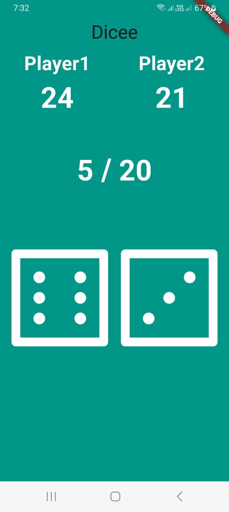

# DiceAppFlutter

DiceAppFlutter is a Flutter application that simulates rolling two dice for two players. The application includes score counters for each player, as well as a main counter for the total number of swings of the dice. Once the main counter reaches 20, the scores reset, and the player with the highest score becomes the winner.

## Features

- Simulates rolling two dice for two players.
- Tracks individual score counters for each player.
- Includes a main counter for total number swings of the dice.
- Resets scores when the main counter reaches 20.
- Determines the winner based on the highest score after reset.

## Installation

To run the DiceAppFlutter application, follow these steps:

1. Ensure you have Flutter installed on your development environment.
2. Clone this repository to your local machine using Git
3. Navigate to the project directory
4. Run the application

## Usage

- Upon launching the application, you will see the main screen with the dice and score counters.
- Tap on the dice to roll them and update the scores.
- The main counter keeps track of the total number of dice swings.
- When the main counter reaches 20, the scores reset, and a winner is determined.
- The player with the highest score after reset wins the game.

## Contributing

Contributions are welcome! If you'd like to contribute to DiceAppFlutter, please follow these guidelines:

1. Fork the repository.
2. Create your feature branch: `git checkout -b feature-name`.
3. Commit your changes: `git commit -m 'Add some feature'`.
4. Push to the branch: `git push origin feature-name`.
5. Submit a pull request.

### References 
[Udemy](https://www.udemy.com/course/flutter-bootcamp-with-dart)
 
